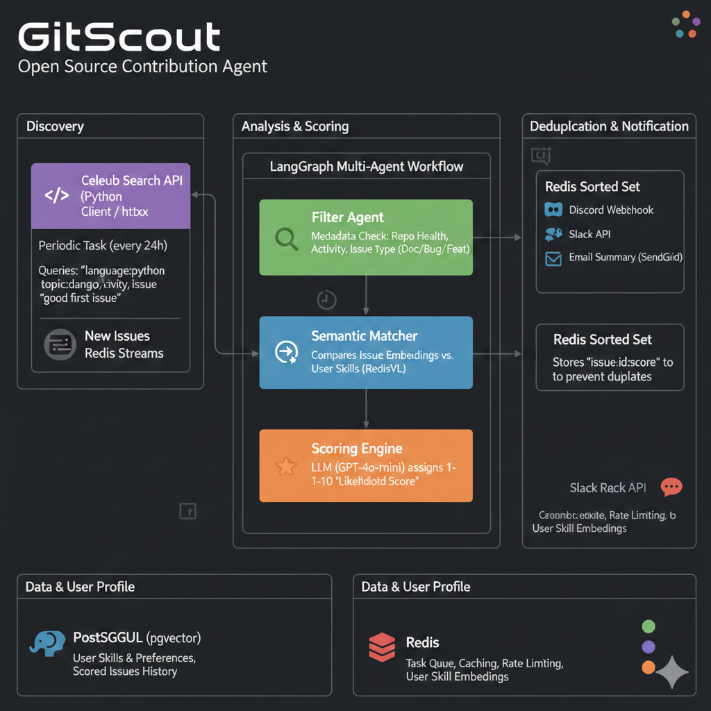

If you want to skip the heavy lifting of cloning and indexing entire codebases, you can pivot the project into a **High-Signal Issue Intelligence Agent**.

Without a codebase explorer, the agent shifts from "How do I solve this?" to "Is this issue worth my time?" This makes the system much faster, lighter, and easier to deploy since you won't need massive vector storage or local disk space for clones.

---

### **The Revised Architecture: "The Lead Qualifier"**

In this version, the agent focuses on **metadata analysis** and **semantic reasoning** based solely on the issue text and repository stats.

#### **1. The Filter Agent (The "Gatekeeper")**

Instead of reading code, this agent uses the GitHub API to pull "Contextual Metadata."

* **Repo Health:** It checks the "Stars to Issues" ratio. (A repo with 5,000 issues and no activity is a "zombie" repo).
* **Maintainer Responsiveness:** It checks the average time to close a PR or respond to a comment.
* **Issue Difficulty:** It uses LLM reasoning to categorize the issue based on the description (e.g., "Documentation," "Bug Fix," "Feature Request").

#### **2. The Semantic Matcher (Skill Alignment)**

Since it’s not reading the code, it performs a **semantic search** between the issue description and your resume/skills.

* **Tech:** You can use a lightweight **RedisVL (Redis Vector Library)** to store your skill set as embeddings.
* **Logic:** When a new issue is fetched, the agent asks: *"Does this issue description suggest a need for Celery/Redis expertise, or is it just frontend CSS?"*

---

### **New Project Roadmap (No-Codebase Version)**

| Component | Responsibility | Tech Stack |
| --- | --- | --- |
| **Discovery** | Fetches issues with specific labels (e.g., `good-first-issue`). | `Celery Beat` + `GitHub API` |
| **Scoring Engine** | Assigns a 1-10 score based on "Likelihood of PR Acceptance." | `LangChain` + `gemini` |
| **Deduplication** | Ensures you don't get the same issue notification twice. | `Redis` (using Sets) |
| **Notification** | Sends a clean Markdown summary to a Discord/Slack webhook. | `Python Requests/discord-webhook` |

---

### **Something Extra to Learn: "Graph-Based Ranking"**

learn **NetworkX** (a Python library for studying graphs).

* **The Idea:** Build a small graph of the "Open Source Ecosystem."
* **Implementation:** Link repositories to contributors. If a repo you like is "starred" by people who contribute to Django or LangChain, your agent can prioritize that repo as a "high-quality" target. This introduces you to **Social Graph Analysis**, which is a massive field in Data Science.

### **Why this is better for a "Solo" build:**

1. **Lower Cost:** You aren't processing thousands of tokens of source code.
2. **Zero Maintenance:** You don't have to worry about cleaning up `/tmp` directories full of cloned repos.
3. **Speed:** The agent can "scan" 100 repositories in seconds rather than minutes.

